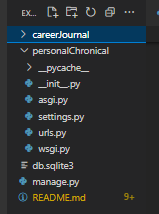
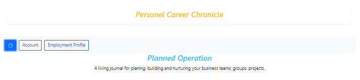
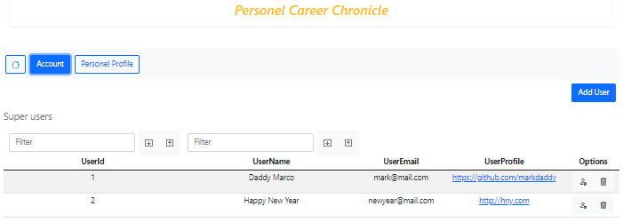
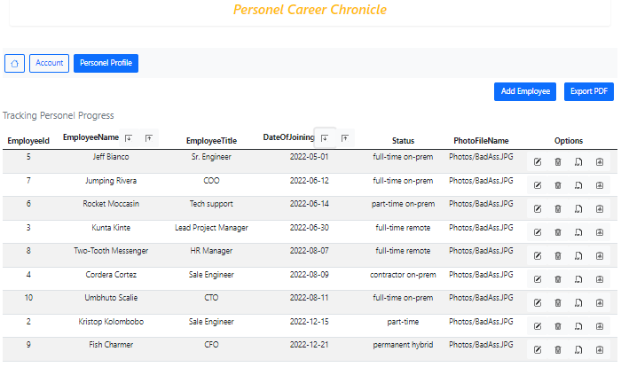

# React JS + Python Django + SQLite
i.e. [frontend] + [backend] + [database]

## <span style="color:yellow">About</span>

This web application is an internal business tool that can be used by business management personel to plan, build, and track their work force.

## <span style="color:yellow">Coding Process</span>

*Frontend:*<strong> ReactJS</strong>

*Backend:*<strong> Python Django</strong>

*Database:*<strong> SQLite3</strong>

## <span style="color:yellow">Install</span>

+ **Python**
+ **Visual Studio Code**
+ **sqlitestudio**
+ **postman**
+ **nodejs**

```shell
    - pip install django
    - pip install djangorestframework
    - pip install django-cors-headers
```

## Reference

[**django**](https://www.djangoproject.com/)

## <span style="color:yellow">Create Django Project</span>

```bash
django-admin startproject personalchronical
cd personalchronical
code .
```

<span style="color:yellow">Project layout</span>



<hr>

## <span style="color:yellow">Let's go code maker!</span>

<span style="color:yellow">Run server</span>
```bash
python .\manage.py runserver
```

<span style="color:yellow">Create front-end app</span>

```bash
python .\manage.py startapp careerjournal
```

<span style="color:yellow">Add entries into `settings.py`</span>

```config
[
    ...

    'rest_framework',
    'corsheaders',
    'careerjournal.apps.CareerjournalConfig',
]

CORS_ORIGIN_ALLOW_ALL = True

MIDDLEWARE = [
    'corsheaders.middleware.CorsMiddleware',

    ...
]

```

<span style="color:yellow">Models code for `careerjournal/models.py`</span>

```python
# Create your models here.
class Users(models.Model):
    UserId = models.AutoField(primary_key=True)
    UserName = models.CharField(max_length=500)
    UserEmail = models.CharField(max_length=100)
    
class Employment(models.Model):
    EmployeeId = models.AutoField(primary_key=True)
    EmployeeName = models.CharField(max_length=500)
    EmployeeTitle = models.CharField(max_length=500)
    DateOfJoining = models.DateField()
    PhotoFileName = models.CharField(max_length=500)

```


<span style="color:yellow">Create database</span>

```bash
python .\manage.py makemigrations careerjournal
```

console output
```shell
PS D:\devel\PYTHON-DEV\personalChronical> python .\manage.py makemigrations careerjournal
Migrations for 'careerjournal':
  careerJournal\migrations\0001_initial.py
    - Create model Employment
    - Create model Users
PS D:\devel\PYTHON-DEV\personalChronical>
```


<span style="color:yellow">migrate tables</span>
```bash
python .\manage.py migrate careerjournal
```

*You can verify the existence of the database using the `sqlitestudio`*


<span style="color:yellow">Add file `careerjournal/serializers.py`</span>

```python
from rest_framework import serializers
from careerJournal.models import Users, Employment

class UsersSerializer(serializers.ModelsSerializer):
    class Meta:
        model=Users
        fields=('UserId', 'UserName', 'UserEmail')
        
class EmploymentSerializer(serializers.ModelsSerializer):
    class Meta:
        model=Employment
        fields=('EmployeeId', 'EmployeeName', 'EmployeeTitle', 'DateOfJoining', 'PhotoFileName')
```

<span style="color:red">**Note**</span> if `import rest_frame` throws error and you are using `venv`, then `Ctrl+shift+P`, enter <span style="color:green">Python:Select Interpreter</span>  Then, select the active venv name.  This would reference the correct virtual python scripts.


Next, create `serializer` in `careerJournal/views.py`  **see code**

Add `careerJournal/urls.py`
```python
from django.urls import re_path
from careerJournal import views

from django.conf.urls.static import static
from django.conf import settings

urlpatterns = [ 
    re_path(r'^user$', views.usersApi),
    re_path(r'^user/([0-9]+)$', views.usersApi),
    
    re_path(r'^employee$', views.employmentApi),
    re_path(r'^employee/([0-9]+)$', views.employmentApi),
    
    re_path(r'^employee/savefile', views.saveFile)
]+static(settings.MEDIA_URL, document_root=settings.MEDIA_ROOT)
```

Add routes to `careerJournal/views.py`
```python
from django.shortcuts import render
# csrf allows other domains to access our methods
from django.views.decorators.csrf import csrf_exempt
# JSONParser to parse incoming data models
from rest_framework.parsers import JSONParser
from django.http.response import JsonResponse

from careerJournal.models import Users, Employment
from careerJournal.serializers import UsersSerializer, EmploymentSerializer

# storage module
from django.core.files.storage import default_storage


# Create your views here.
# CRUD operations for the users table
@csrf_exempt
def usersApi(request, id=0):
    if request.method=='GET':
        users = Users.objects.all()
        user_serializer = UsersSerializer(users, many=True)
        return JsonResponse(user_serializer.data, safe=False)
    elif request.method=='POST':
        user_data = JSONParser().parse(request)
        users_serializer = UsersSerializer( data=user_data)
        if users_serializer.is_valid():
            users_serializer.save()
            return JsonResponse("Added Successfully", safe=False)
        return JsonResponse("Failed to add", safe= False)
    elif request.method=='PUT':
        user_data = JSONParser().parse(request)
        user = Users.objects.get(UserId=user_data['UserId'])
        users_serializer = UsersSerializer(user, data=user_data)
        if users_serializer.is_valid():
            users_serializer.save()
            return JsonResponse("Updated Successfully", safe=False)
        return JsonResponse("Failed to update", safe=False)
    elif request.method=='DELETE':
        user = Users.objects.get(UserId=id)
        user.delete()
        return JsonResponse("Delete Successfully", safe=False)
        


# CRUD operations for the employment table
@csrf_exempt
def employmentApi(request, id=0):
    if request.method=='GET':
        employees = Employment.objects.all()
        employee_serializer = EmploymentSerializer(employees, many=True)
        return JsonResponse(employee_serializer.data, safe=False)
    elif request.method=='POST':
        employee_data = JSONParser().parse(request)
        employees_serializer = EmploymentSerializer(data=employee_data)
        if employees_serializer.is_valid():
            employees_serializer.save()
            return JsonResponse("Added Successfully", safe=False)
        return JsonResponse("Failed to add", safe= False)
    elif request.method=='PUT':
        employee_data = JSONParser().parse(request)
        employee = Employment.objects.get(EmployeeId=employee_data['EmployeeId'])
        employees_serializer = EmploymentSerializer(employee, data=employee_data)
        if employees_serializer.is_valid():
            employees_serializer.save()
            return JsonResponse("Updated Successfully", safe=False)
        return JsonResponse("Failed to update", safe=False)
    elif request.method=='DELETE':
        employee = Employment.objects.get(EmployeeId=id)
        employee.delete()
        return JsonResponse("Delete Successfully", safe=False)
    
    
@csrf_exempt
def saveFile(request):
    file = request.FILES['file']
    file_name = default_storage.save(file.name, file)
    return JsonResponse(file_name, safe=False)
```

Insert paths into server `urls.py`
```python
from django.urls import include, re_path


urlpatterns = [
    path('admin/', admin.site.urls),
    re_path(r'^', include('careerJournal.urls'))
]
```

<br><br>
<hr>

# <span style="color:yellow">Create the Frontend ReactJS Project</span>

Create a separate frontend ReactJS project and open it in separate VSCode.

```bash
npx create-react-app journalclient
cd journalclient
code .
```

Edit `src/App.js` and `public/index.html`

```javascript
/* src/App.js */
import logo from './logo.svg';
import './App.css';

function App() {
  return (
    <div className="App container">
      <h3 className="d-flex justify-content-center m-3">
        React JS Frontend
      </h3>  
    </div>
  );
}

export default App;
```

Insert CDN links for css/javascript from [getbootstrap.com](https://getbootstrap.com/docs/5.3/getting-started/introduction/) code into `public/index.html`
at the head tag and at bottom of body tag.

**Install React Router DOM**

```bash
npm install react-router-dom
```

Add files `src/Home.js`, `src/User.js`, and `src/Employment.js` to extend components.

```javascript
/* src/Home.js */
import React, {Component} from 'react';

export class Home extends Component {
    render() {
        return (
            <div>
                <h3>This is the Home page</h3>
            </div>
        )
    }
}
```

```javascript
/* scr/Employment.js */
import React, {Component} from 'react';

export class Employment extends Component {
    render() {
        return (
            <div>
                <h3>This is the Employment page</h3>
            </div>
        )
    }
}
```

```javascript
/* src/User.js */
import React, {Component} from 'react';

export class User extends Component {
    render() {
        return (
            <div>
                <h3>This is the User page</h3>
            </div>
        )
    }
}
```

Register extended components in `src/App.js`

```javascript
...
import {Home} from './Home';
import {User} from './User';
import {Employment} from './Employment';
/* modules needed for routing*/
import { BrowserRoute, Route, Routes, NavLink } from 'react-router-dom';
...

```

Create file `src/Variables.js` to store API endpoints.  i.e. Referencing the endpoints from the Backend server.
```javascript
export const variables = {
    API_URL:"http://127.0.0.1:8000/",
    PHOTO_URL:"http://127.0.0.1:8000/Photos/"
}
```

Very usefull [Bootstrap Icons](https://icons.getbootstrap.com/) for `edit` and `delete` to liven up the frontend.

## Frontend Snapshots





